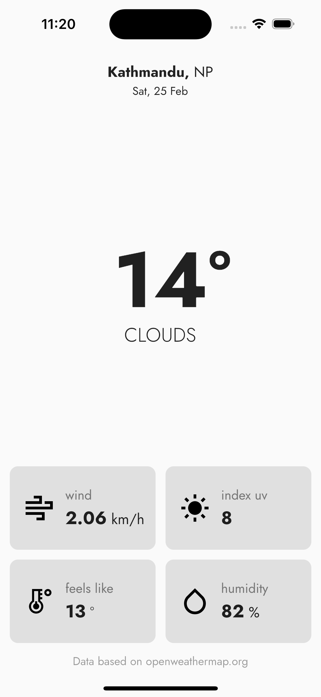
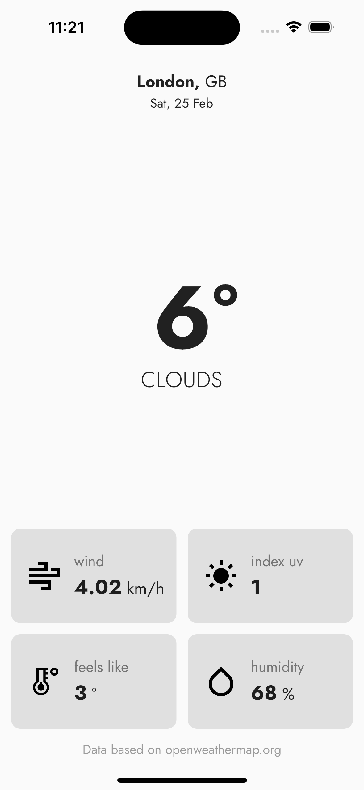

# Weather App

This is a weather app built with Flutter that uses the OpenWeatherMap API to fetch real-time weather information for a given location.

## Prerequisites

To run this app, you will need an OpenWeatherMap API key. If you don't already have one, you can get one for free by signing up on the [OpenWeatherMap website](https://openweathermap.org/). Once you have your API key, create a new `.env` file in the root folder and add your API key as the value of `API_KEY`.

API_KEY=your_api_key_here

## Screenshots

## Features

- Real-time weather information for a given location
- Current temperature, humidity, wind speed, and uv index

## How to Use

1. Clone the repository
2. Create a new `.env` file in the root folder with your OpenWeatherMap API key
3. Run `flutter packages get` to install the required packages
4. Run the app using `flutter run` or your preferred IDE

## Libraries Used

- [http](https://pub.dev/packages/dio) - For making HTTP requests
- [flutter_bloc](https://pub.dev/packages/flutter_bloc) - For state management
- [google_fonts](https://pub.dev/packages/google_fonts) - For fonts
- [get_it](https://pub.dev/packages/get_it) - For service locator
- [flutter_dotenv](https://pub.dev/packages/flutter_dotenv) - For env file
- [intl](https://pub.dev/packages/intl) - For formatting dates
- [flutter_svg](https://pub.dev/packages/flutter_svg) - For displaying SVG icons

## Credits

- Weather data provided by [OpenWeatherMap](https://openweathermap.org/)

## License

This project is licensed under the MIT License - see the [LICENSE](LICENSE) file for details.
